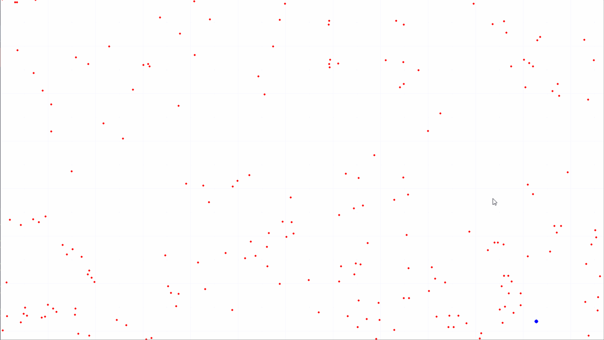

# boids
Emergent behaviour of swarming agents, visualised

This is a super useful technique for modelling crowd behaviour, with immediate canonical applications to simulating:
 - flocks of birds
 - shoals of fish
 - packs of animals
 - hordes of zombies
 
A cursory implementation of a "pursuit/flee" ruleset results in the ```wolfpack_boids.py``` file, where a population of red wolves pursues a blue sheep across the field
(click to see larger images)
| plain algorithm | pursuit/flee ruleset |
|:---:|:---:|
||
